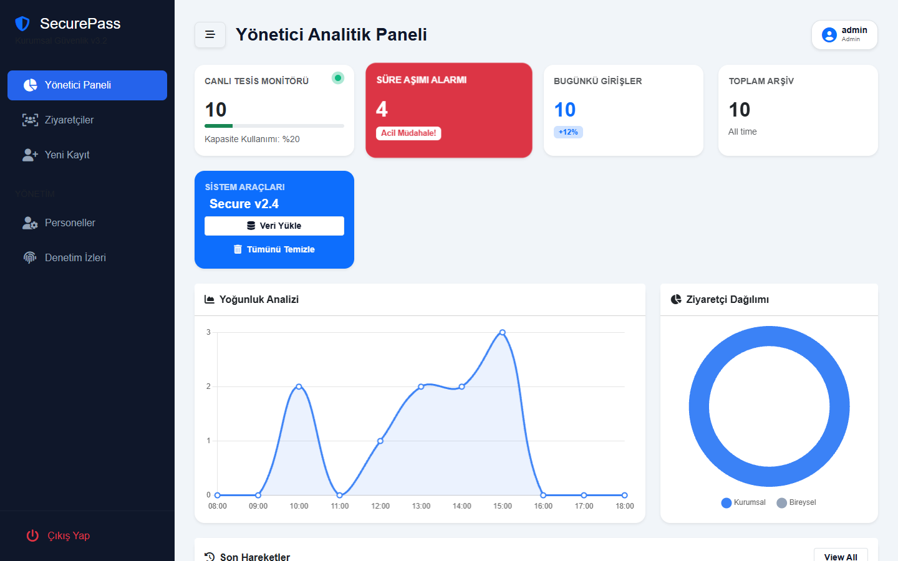
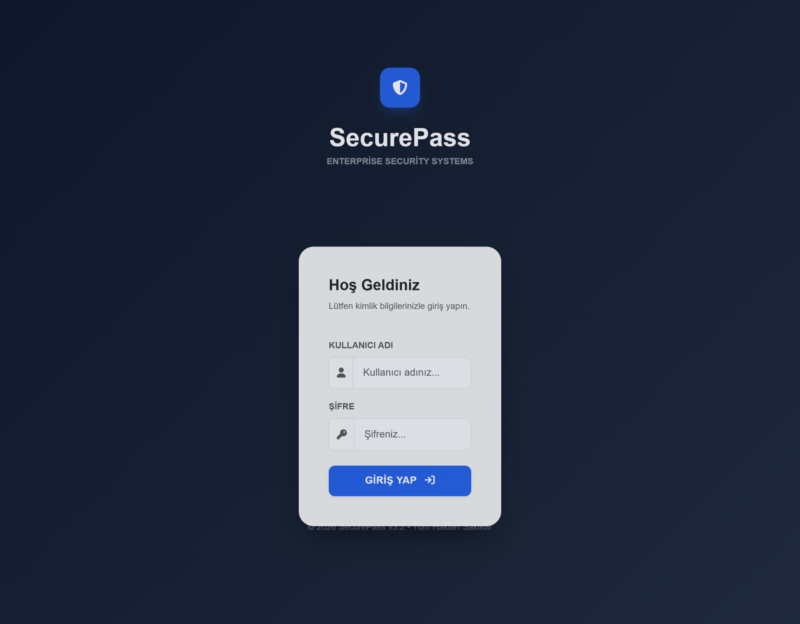
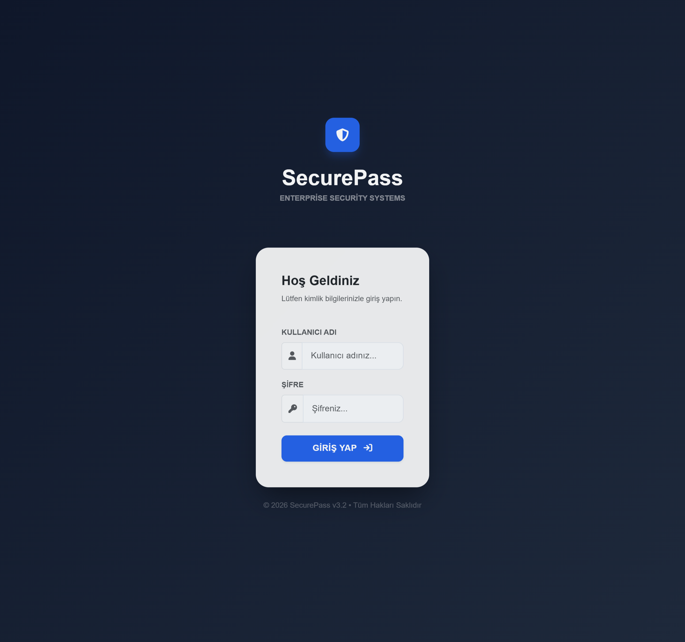
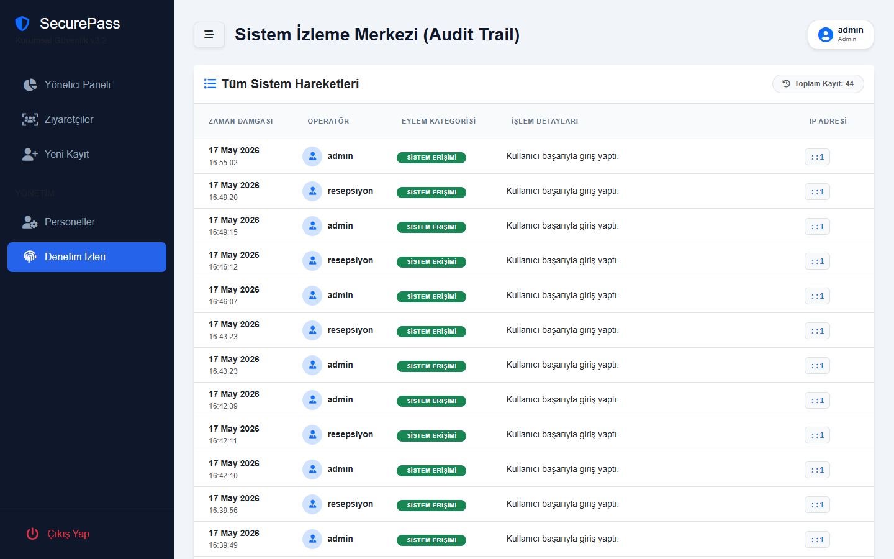
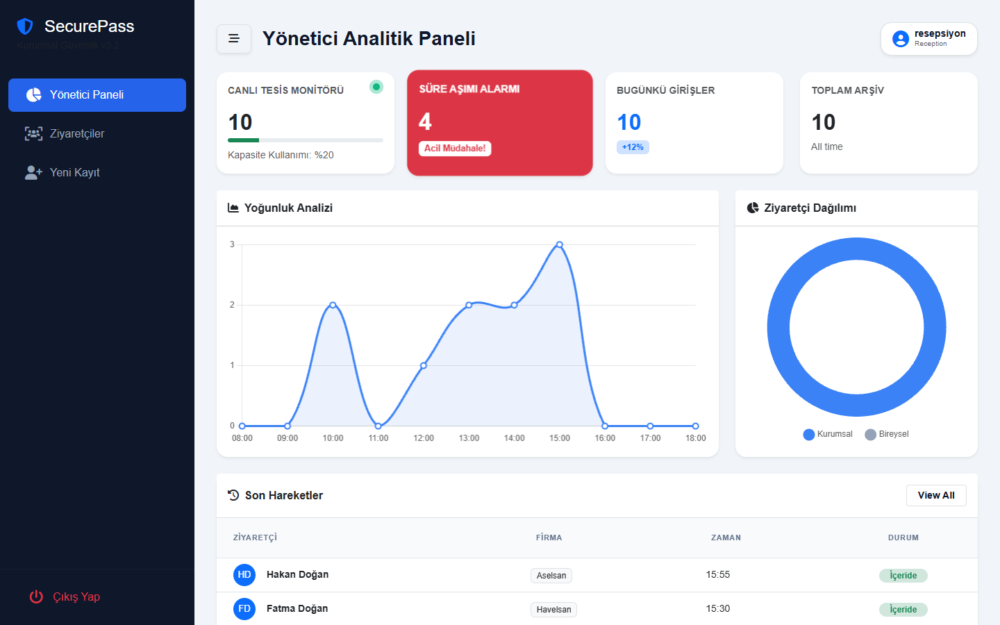
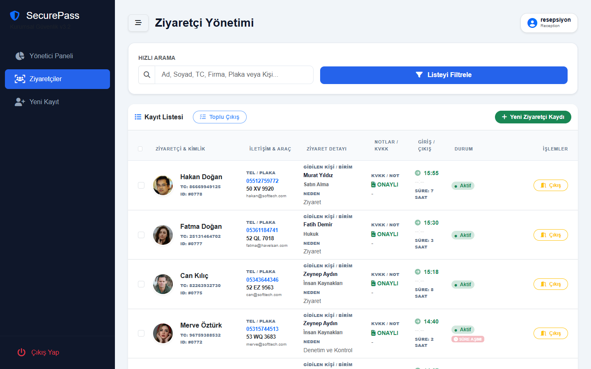
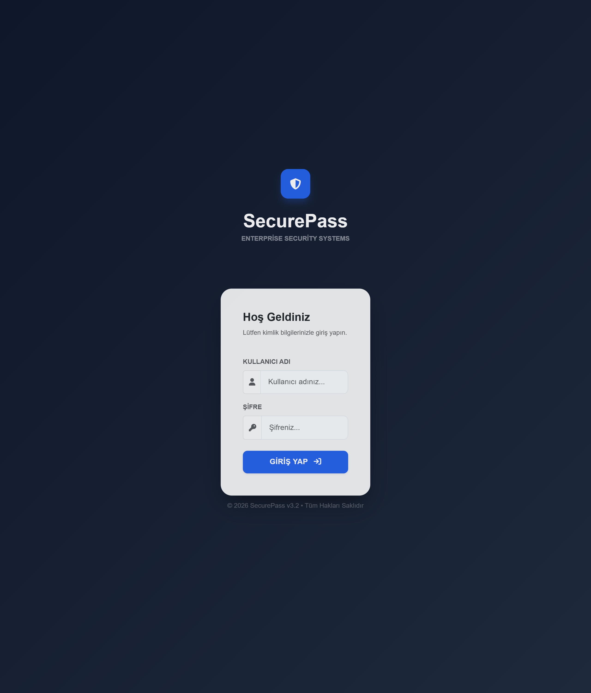
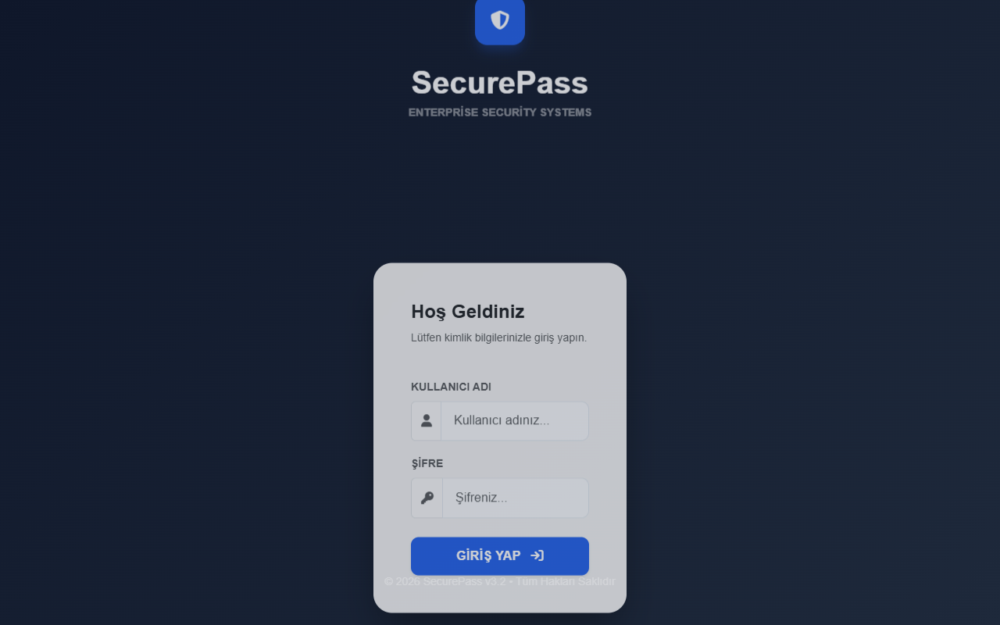

# 🛡️ SecurePass - Kurumsal Ziyaretçi Yönetim & Güvenlik Sistemi

SecurePass, modern işletmeler için tasarlanmış, güvenlik odaklı, yüksek performanslı ve genişletilebilir bir **Ziyaretçi Yönetim Sistemi (VMS)** çözümüdür. Kağıt üzerindeki kayıt defterlerini dijital, denetlenebilir ve akıllı bir ekosisteme dönüştürür.


## 🌟 Öne Çıkan Özellikler

### 🛡️ Üst Düzey Güvenlik
*   **RBAC (Rol Bazlı Yetkilendirme):** Admin ve Resepsiyon rolleri ile tam yetki kontrolü.
*   **Audit Trail:** Sistemdeki her işlem (giriş, çıkış, silme, deneme) IP ve kullanıcı bazlı loglanır.
*   **Brute-Force Koruması:** Giriş denemeleri için gelişmiş Rate Limiting (Hız Sınırlama).
*   **Güvenli Kimlik Doğrulama:** Cookie-based şifreli oturum yönetimi.

### 📊 Akıllı Dashboard & Analitik
*   **Gerçek Zamanlı Tesis Monitörü:** Binada kaç kişi olduğunu anlık takip edin.
*   **Süre Aşımı Alarmı:** Tahmini çıkış vaktini geçen ziyaretçiler için otomatik görsel uyarılar.
*   **Yoğunluk Analizi:** Saatlik giriş trafiğini gösteren dinamik grafikler (Chart.js).
*   **Ziyaretçi Dağılımı:** Kurumsal vs. Bireysel ziyaretçi pasta grafiği.

### 📸 Modern Ziyaretçi Kaydı
*   **Fotoğraf Kaydı:** Güvenlik politikası gereği fotoğraf yükleme zorunluluğu (BLOB formatında veritabanında saklanır).
*   **KVKK Uyumu:** Dijital aydınlatma metni onayı ve veri imha (Hard Delete) politikası.
*   **Hızlı Arama:** Binlerce kayıt arasından TC, Ad, Soyad veya Plaka ile anlık filtreleme.
*   **Toplu Çıkış:** Mesai bitiminde tek tıkla tüm ziyaretçilerin çıkışını yapma kolaylığı.

## 🏗️ Teknik Mimari

Proje, **S.O.L.I.D** prensiplerine sadık kalınarak, katmanlı mimari (N-Tier) ile geliştirilmiştir:

*   **SecurePass.Core:** Domain modelleri ve temel varlıklar (Entities).
*   **SecurePass.DataAccess:** Entity Framework Core tabanlı veri erişimi ve Migrations.
*   **SecurePass.Business:** İş mantığı, servis katmanı ve DTO yönetimleri.
*   **SecurePass.Web:** ASP.NET Core MVC tabanlı, SignalR ve modern UI bileşenleri içeren sunum katmanı.

**Kullanılan Teknolojiler:**
*   **Backend:** .NET 10, EF Core, SignalR, Rate Limiting Middleware.
*   **Database:** MS SQL Server.
*   **Frontend:** Bootstrap 5, FontAwesome 6, Animate.css, Chart.js.

## 🚀 Kurulum Adımları

### 1. Gereksinimler
*   [.NET 10 SDK](https://dotnet.microsoft.com/download)
*   [SQL Server](https://www.microsoft.com/en-us/sql-server/sql-server-downloads) (veya LocalDB)

### 2. Projeyi Klonlayın
```bash
git clone https://github.com/kullaniciadi/SecurePass.git
cd SecurePass
```

### 3. Veritabanı Yapılandırması
`SecurePass.Web/appsettings.json` dosyasındaki bağlantı cümlesini (ConnectionString) kendi SQL Server bilgilerinizle güncelleyin:
```json
"ConnectionStrings": {
  "DefaultConnection": "Server=YOUR_SERVER;Database=SecurePassDB;Trusted_Connection=True;MultipleActiveResultSets=true;TrustServerCertificate=True"
}
```

### 4. Çalıştırın
Proje çalıştırıldığında veritabanı ve varsayılan kullanıcılar otomatik olarak oluşturulacaktır.
```bash
dotnet run --project SecurePass.Web/SecurePass.Web.csproj
```

## 🔐 Kullanım Bilgileri

Sisteme giriş için varsayılan hesaplar:

| Rol | Kullanıcı Adı | Şifre |
| :--- | :--- | :--- |
| **Yönetici (Admin)** | admin | 123 |
| **Resepsiyon** | resepsiyon | 123 |

> **Not:** Üretim ortamına geçerken şifreleri değiştirmeyi unutmayın!

## 📸 Ekran Görüntüleri

### 🛡️ Yönetici (Admin) Perspektifi
Yöneticiler sistemin tüm kontrolüne ve analitik verilere sahiptir.

**1. Dashboard & Analitik Paneli**


**2. Personel Yönetimi**


**3. Ziyaretçi Takip Listesi**


**4. Sistem Günlükleri (Audit Trail)**


---

### 🛎️ Resepsiyon Perspektifi
Resepsiyon personeli için optimize edilmiş, operasyonel odaklı ekranlar.

**1. Dashboard (Hızlı Durum)**


**2. Ziyaretçi Kayıt & Filtreleme**


**3. Detaylı Yeni Kayıt Formu**


---

### 🔐 Güvenli Giriş Ekranı


## 📄 Lisans
Bu proje MIT lisansı altında lisanslanmıştır.

---
Developed with ❤️ by [Ömer Börekci]
